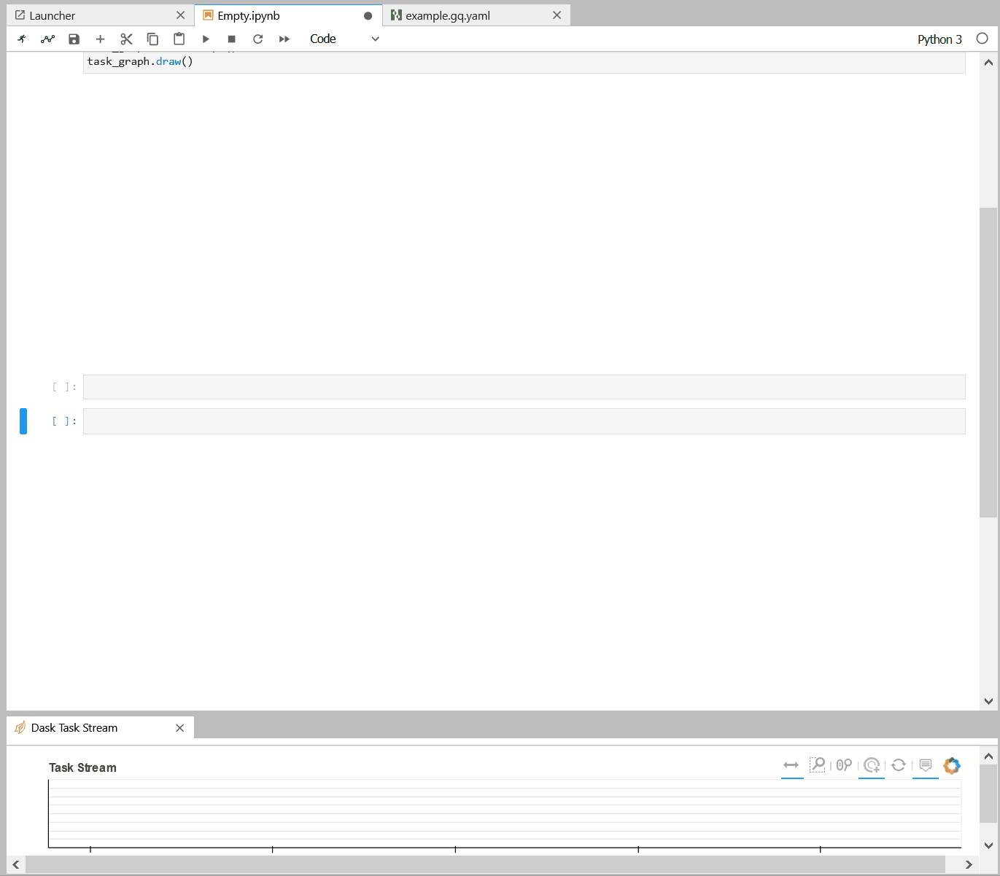

# gQuant - GPU Accelerated Graph Computation for Quantitative Analyst Tasks

**NOTE:** For the latest stable [README.md](https://github.com/rapidsai/gquant/blob/main/README.md) ensure you are on the `main` branch.

## What is gQuant?
gQuant is a collection of open-source GPU accelerated Python tools and examples  for quantitative analyst tasks,  built on top of the [RAPIDS AI](https://rapids.ai/) project, [Numba](https://numba.pydata.org/), and [Dask](https://dask.org/).

The examples range from simple accelerated calculation of technical trading indicators through defining workflows for interactively developing trading strategies and automating many typical tasks.

The extensibility of the system is highlighted by examples showing how to create a dataframe flow graph, which allows for easy re-use and composability of higher level workflows.

The examples also show how to easily convert a single-threaded solution into a Dask distributed one. 

These examples can be used as-is or, as they are open source, can be extended to suit your environments.

## gQuant jupyterlab extension


The gQuant Juyterlab extension provides the user interface to build the dataframe flow TaskGraph easily. It takes advantage of the open sources projects like [jupyterlab](https://github.com/jupyterlab/jupyterlab), [ipywidget](https://github.com/jupyter-widgets/ipywidgets), [React](https://reactjs.org/) and [D3](https://d3js.org/). It features:
1. Takes full advantage of the JupyterLab project that the extension adds commands to Jupyterlab context menu, command palette and bind them with keyboard shortcuts to speed up the productivity.  
2. Define a new TaskGraph file format `.gq.yaml` that can be edited in the Jupyterlab. 
3. Visually presents the TaskGraph as a DAG graph. Users can zoom in and out, freely move the nodes around, and make connections between nodes.
4. Use the special `Ouput Collector` to gather the results and organize them in a tab widget. The IPython [rich display](https://ipython.readthedocs.io/en/stable/config/integrating.html#rich-display) is fully supported.
5. Visually shows the progress of graph evaluation and computation dependence.
6. Automatically generate the UI elements to edit and validate the Node configuration given the configuration JSON schema. It exposes the function API in a user-friendly way. User can change the configuration and re-run the computation to test out the hyperparameters easily.
7. Dynamically compute the input-output ports compatibility, dataframe columns names and types, ports types to prevent connection errors. 
8. Nodes can have multiple output ports that can be used to generate different output types. E.g. some data loader Node provides both `cudf` and `dask_cudf` output ports. The multiple GPUs distributed computation computation is automatically enabled by switching to the `dask_cudf` output port. 
9. Provides the standard API to extend your computation Nodes.
10. The composite node can encapsulate the TaskGraph into a single node for easy reuse. The composite node can be exported as a regular gQuant node without any coding.

### Binary pip installation

To install the gQuant graph computation library, first install the dependence libraries:
```bash
pip install dask[dataframe] distributed networkx
conda install python-graphviz ruamel.yaml numpy pandas
```
Then install gquant lib:
```bash
pip install gquant
```

To install JupyterLab plugin, install the following dependence libraries:
```bash
conda install nodejs ipywidgets
```
Build the ipywidgets Jupyterlab plugin 
```bash
jupyter labextension install @jupyter-widgets/jupyterlab-manager@2.0
```
Then install the gquantlab lib:
```bash
pip install gquantlab==0.1.1
```
If you launch the JupyterLab, it will prompt to build the new plugin. You can
explicitly build it by: 
```bash
jupyter lab build
```

Note, the gQuant node plugins are defined in the `gquantrc` file. Check the `System environment` for details


### Prerequisites
- NVIDIA Pascal™ GPU architecture or better.
- [CUDA 9.2](https://developer.nvidia.com/cuda-92-download-archive) with driver v396.37+ or [CUDA 10.0](https://developer.nvidia.com/cuda-10.0-download-archive) with driver v410.48+.
- Ubuntu 16.04 or 18.04.
- [NVIDIA-docker v2+](https://github.com/nvidia/nvidia-docker/wiki/Frequently-Asked-Questions#how-do-i-install-20-if-im-not-using-the-latest-docker-version).


### Download data files

Run the following command at the project root diretory 
```bash
bash download_data.sh

```

### Install

gQuant source code can be downloaded from [GitHub](https://github.com/rapidsai/gquant).

- Git clone source code:

```bash
$ git clone https://github.com/rapidsai/gQuant.git
```


- Build and run the container:

```bash
$ cd gQuant/docker && . build.sh
```
When building the container, you can run gQuant in two modes: dev or prod. In the dev mode, please check the README file in `gquantlab` directory to install the plugins and Python libraries. 

In the production mode, you can launch the container by following command and start to use it 
```bash
$ docker run --runtime=nvidia --rm -it -p 8888:8888 -p 8787:8787 -p 8786:8786 gquant/gquant:[tag from the build]
```

### Example notebooks

Example notebooks, tutorial showcasing, can be found in __notebooks__ folder.


### System environment 

There are a few system environment that the user can overwrite. 

The custom module files are specified in the `gquantrc` file. `GQUANT_CONFIG` enviroment variable points to the location of this file. By default, it points to 
`$CWD\gquantrc`. 

In the example `gquantrc`, system environment variable `MODULEPATH` is used to point to the paths of the module files.
To start the jupyterlab, please make sure `MODULEPATH` is set properly. 

For example, if you want to start the jupyterlab in the gQuant root directory.
```bash
MODULEPATH=$PWD/modules jupyter-lab --allow-root --ip=0.0.0.0 --no-browser --NotebookApp.token=''
```

Or, if you want to start the jupyterlab in the gquantlab directory.
```bash
GQUANT_CONFIG=../gquantrc MODULEPATH=$PWD/../modules jupyter-lab --allow-root --ip=0.0.0.0 --no-browser --NotebookApp.token=''
```
