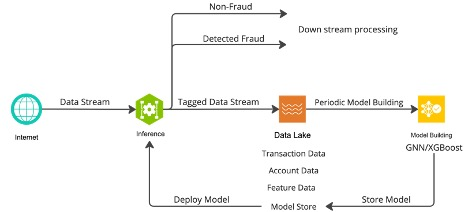
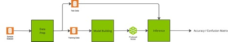

# 
Graph Neural Network Based Model Building for Credit Card Fraud Dectection

  

What is presented in this open-source folder are example Jupyter notebooks of
three steps within a larger Credit Card Fraud Detection Workflow.  Those steps
being: (a) data prep, (b) model building, and (c) inference. Those three steps
are presented as independent Jupyter Notebooks.

What this example does not show, and which needs to be highlighted, is the
complexity of scaling the problem. The sample datasets are of trivial single-GPU
size. The NVIDIA RAPIDS suite of AI libraries has been proven to scale while still
providing leading performance.

# [Find the Notebooks here](https://github.com/nv-morpheus/morpheus-experimental/tree/branch-24.10/ai-credit-fraud-workflow)  

## Background
Transaction fraud is
[expected to exceed $43B by 2026](https://nilsonreport.com/articles/card-fraud-losses-worldwide/)
and poses a significant challenge upon financial institutions to detect and prevent
sophisticated fraudulent activities. Traditionally, financial institutions
have relied upon rules based techniques which are reactive in nature and
result in higher false positives and lower fraud detection accuracy. As data
volumes and attacks have become more sophisticated, accelerated machine and
graph learning techniques become mandatory and is a more proactive approach. 
AI for fraud detection uses multiple machine learning models to detect anomalies
in customer behaviors and connections as well as patterns of accounts and
behaviors that fit fraudulent characteristics.

Fraud detection has been a challenge across banking, finance, retail and
e-commerce. Fraud doesn’t only hurt organizations financially, it can also
do reputational harm. It’s a headache for consumers, as well, when fraud models
from financial services firms overreact and register false positives that shut
down legitimate transactions. Financial services sectors are developing more
advanced models using more data to fortify themselves against losses
financially and reputationally. They’re also aiming to reduce false positives
in fraud detection for transactions to improve customer satisfaction and win
greater share among merchants.

As data needs grow and AI models expand in size, intricacy, and diversity,
energy-efficient processing power is becoming more critical to operations in
financial services. Traditional data science pipelines lack the necessary
acceleration to handle the volumes of data involved in fraud detection,
resulting in slower processing times, which limits real-time data analysis
and detection of fraud. To efficiently manage large-scale datasets and deliver
real-time performance for AI in production, financial institutions must shift
from legacy infrastructure to accelerated computing.

The Fraud Detection AI workflow offers enterprises an end-to-end solution using
the NVIDIA accelerated computing platform for GPU-accelerated data processing
and AI deployment, enabling real-time analysis and detection of fraudulent
activities. It is important to note that there are several types of fraud.
The initial focus is on supervised credit card transaction fraud. Other areas
beyond fraud that could be converted to products include:New Account Fraud,
Account Takeover, Fraud Ring Detection, Abnormal Behavior, and Anti-Money
Laundering.  

## High-Level Architecture
The general fraud architecture, as depicted below at a very high-level, uses
Morpheus to continually inspect and classify all incoming data. What is not
shown in the diagram is what a customer should do if fraud is detected, the
architecture simply shows tagged data being sent to downstream processing.
Those processes should be well defined in the customers’ organization.
Additionally, the post-detected data, what we are calling the Tagged Data
Stream, should be stored in a database or data lake.  Cleaning and preparing
the data could be done using Spark RAPIDS. 

Fraud attacks are continually evolving and therefore it is important to always
be using the latest model. That requires the model(s) to be updated often as
possible. Therefore, the diagram depicts a loop where the GNN Model Building
process is run periodically, the frequency of which is dependent on model
training latency. Given how dynamic this industry is with evolving fraud
trends, institutions who train models adaptively on a frequent basis tend to
have better fraud prevention KPIs as compared to their competitors.

 

  

 

### This Workflow
The above architecture would be typical within a larger financial system where incoming data run through the inference engine first and then periodically a new model build. However, for this example, the workflow is will start with model building and end with Inference. The workflow is depicted below:

 

  

 

 1.	__Data Prep__: the sample dataset is cleaned and prepared, using tools like NVIDIA RAPIDS for efficiency. Data preparation and feature engineering has a significant impact on the performance of model produced. See the section of data preparation for the step we did get the best results
    - Input: The sample dataset
    - Output: Two files; (1) a data set for training the model and a (2) dataset to be used for inference.

2. __Model Building__: this process takes the training data and feeds it into cugraph-pyg for GNN training. However, rather than having the GNN produce a model, the last layer of the GNN is extracted as embeddings and feed into XGBoost for production of a model.
    - Input: Training data file
    - Output: an XGBoost model and GNN model that encodes the data

3. __Inference__: The test dataset, extracted from the sample dataset, is feed into the Inference engine. The output is a confusion matrix showing the number of detected fraud, number of missed fraud, and number of misidentified fraud (false positives) 

 

## Copyright and License
Copyright (c) 2024, NVIDIA CORPORATION. All rights reserved.

 

 Licensed under the Apache License, Version 2.0 (the "License");
 you may not use this file except in compliance with the License.
 You may obtain a copy of the License at
 
 http://www.apache.org/licenses/LICENSE-2.0
 
 Unless required by applicable law or agreed to in writing, software
 distributed under the License is distributed on an "AS IS" BASIS,
 WITHOUT WARRANTIES OR CONDITIONS OF ANY KIND, either express or implied.
 See the License for the specific language governing permissions and
 limitations under the License.
