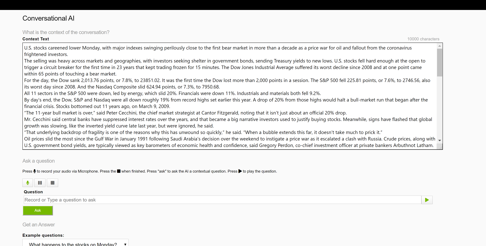

## Simple Conversational AI Demo


### What it is?

It is a simple conversational AI demo that you can ask the question to AI about the provided context text and get the answer back in speech. It deploys RIVA ASR, Tacotron2/Waveglow (we could also have FastPitch/HiFiGAN if available), [BERT](https://github.com/NVIDIA/DeepLearningExamples/tree/master/TensorFlow/LanguageModeling/BERT) models as AI services.

In the larger text area, user can provide any long articles in text to provide question context. The model can find the answer to the question asked. It pre-loaded an article from the WIKI. User can copy-paste their own text to the text area. 

User can either record the question in English audio or type it in text. After clicking the 'Ask' button, the answer will be responded in both text and speech formats. The play button generates speech from the question texts.

There are some "example questions" for users to try. Feel free to come up your own questions for the AI demo.

Not satisfied with the model performance? Try to improve it with your own data. Easy fine-tuning with [Transfer Learning Toolkit](https://developer.nvidia.com/transfer-learning-toolkit).

### How to use?

You need to deploy the [RIVA](https://docs.nvidia.com/deeplearning/riva/index.html) to host all the models in the Triton Server. To use RIVA, go to [NGC](https://ngc.nvidia.com/setup) to sign up or log in to your NGC account. Follow the instruction at [this page](https://ngc.nvidia.com/setup) to setup the API keys for your system.

The easiest way to set it up is to run script:

```bash
bash build.sh
```

Use [docker-compose](https://docs.docker.com/compose/) to orgnize the containers.  The latest `docker-compose` is downloaded in the `bulid.sh` script

```bash
cd riva
./docker-compose up
```

Open up the webpage at:
```
https://ip:8888
```

Note, it is required to use `https://` connection to get the browser microphone to work remotely. Note, you might need to accept the risk warning from the browser to proceed. Have fun playing with it!

To shut down the demo
```bash
./docker-compose down
```

### Change default text

The default context text file(`doc.txt`) and default questions(`questions.txt`) are loaded in the `/workspace/server/text` directory inside the client docker image.
To use your own default text and questions for the demo, you can preprare the `doc.txt` and `questions.txt` files in a different host directory and mount it to the client docker image in the `riva/docker-compose.yml` file using [volumes](https://docs.docker.com/storage/volumes/). E.g.

```yaml
client:
  image: client
  ports:
    - "8888:8888"
  depends_on:
    - "riva"
  volumes:
    - HOST_PATH:/workspace/server/text
  command: ["/usr/bin/python3", "webserver.py"]
```

### Screen shot


